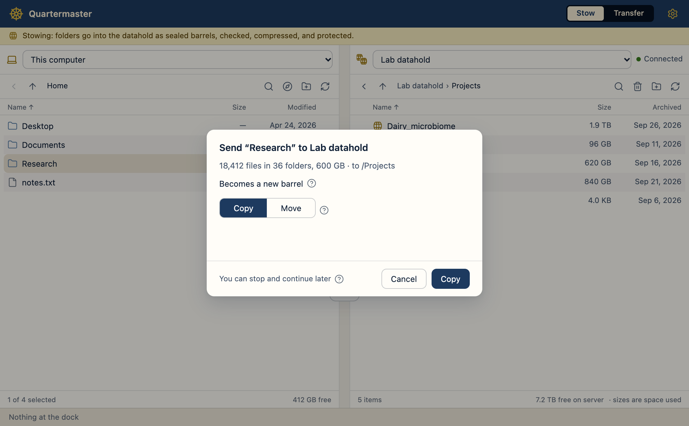
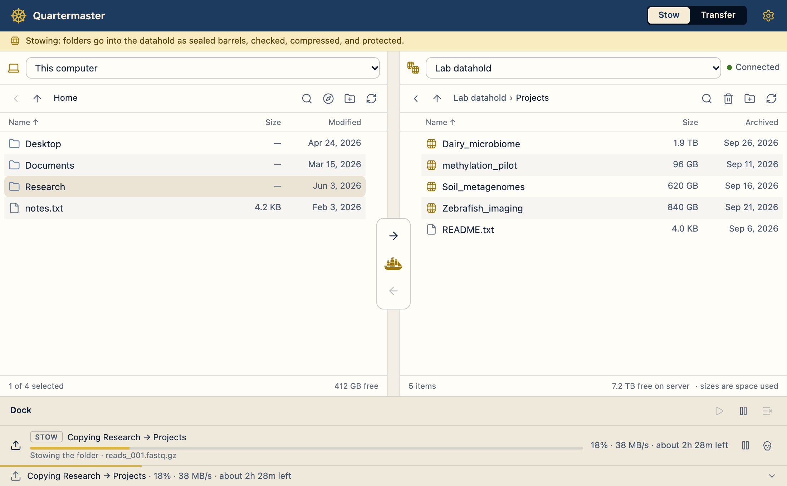
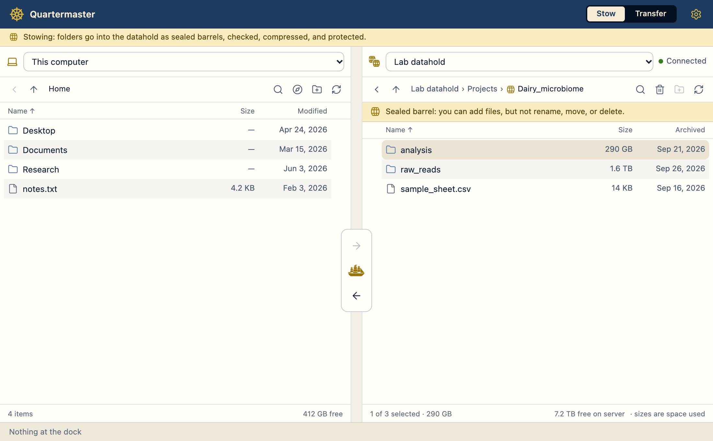
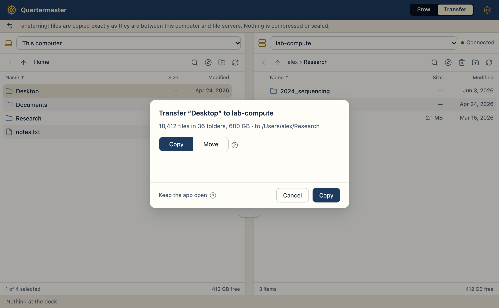

  

<h1 align="center">Quartermaster</h1>

  A safe, verifiable home for finished research data. 
  Stow past projects in an archive on your lab's storage server, and get any file back years later.

  <a href="https://github.com/jonathonthill/quartermaster/releases"><b>Download for macOS, Windows, or Linux</b></a>

## Why

Finished projects pile up on analysis servers, laptops, and external drives. Moving them to
the lab's storage server by hand is slow and easy to get wrong. A large copy can be silently
corrupted, and years later nobody can say whether an archived project is complete, or still
readable. Quartermaster makes archiving a project as simple as dragging a folder, and keeps
checking that it stays intact.

## Dataholds

A **datahold** is an archive on your storage server. Each folder you stow becomes a sealed
project, called a **barrel**.

| | |
|---|---|
| **Checked end to end** | Every file is checksummed (SHA-256) where it starts and again where it lands. A file counts as archived only once the two match. |
| **Originals kept until it's safe** | Choose *Move*, and the originals are deleted only after the whole project is archived and verified. |
| **Protected against damage** | Data is bundled into large packs with PAR2 recovery data, so damaged blocks can be repaired, not just detected. |
| **Checked over time** | The server rechecks every pack on a schedule and repairs what it can, so problems surface early, not years later. |
| **Sealed barrels** | An archived project can be added to, renamed, or moved as a whole, but nothing inside it can be changed or deleted by accident. |
| **Compact** | Files are compressed, and duplicates within a project are stored once. |
| **Easy to get back** | Browse the datahold like ordinary folders, search it, and retrieve any single file or folder without unpacking anything. |
| **Never locked in** | A plain-text index lists every file and where its bytes are, so data can be found with `grep` and extracted with standard tools, even without Quartermaster. The format is [documented](docs/FORMAT.md). |
| **Forgiving** | Something thrown *Overboard* can be restored for 30 days. |

Getting data there is just as careful:

- **Straight from the analysis server.** Projects on an analysis server go directly to the datahold, server to server, so you can close your laptop while they move.
- **Interruptions don't matter.** Pause, lose the connection, or restart: a transfer continues where it stopped.
- **Undo a mistake.** *Abandon ship* (the skull) stops a transfer and removes only what it created.
- **Your usual sign-in.** The app uses your computer's own `ssh`, so your `~/.ssh/config`, keys, passwords, and two-factor sign-in (Duo, authenticator codes, and the like) all work, with the prompts shown in the app.

## Getting started

1. **Download** the app from [Releases](https://github.com/jonathonthill/quartermaster/releases). The builds aren't signed yet, so the first launch needs one extra step:
   - **macOS**: drag Quartermaster to Applications, then right-click it and choose **Open**, and **Open** again. If macOS says the app "is damaged", run `xattr -dr com.apple.quarantine /Applications/Quartermaster.app` in Terminal.
   - **Windows**: if SmartScreen appears, choose **More info**, then **Run anyway**. (Windows builds are newer and less tested.)
   - **Linux**: use the `.AppImage` (make it executable) or the `.deb`.
2. **Add your datahold.** In the right pane's menu, choose **Add a datahold…**. Enter the storage server's address and the folder for the archive, then press **Connect**. If there's no datahold there yet, **Test connection** offers to create one.
3. **Let it install its helper**, if asked. A small program goes into your home folder on the server; nothing needs an administrator.

## Stowing a project

1. Make sure the top bar says **Stow**. The left pane is this computer or a file server, and the right pane is your datahold.
2. On the right, open the folder the project should go in (for example `Projects`). To add files to an existing barrel, open that barrel instead.
3. On the left, find the project's folder and select it. To stow from an analysis server, choose it in the left pane's menu (or **Add a file server…**).
4. Press **→** (or drag the folder across). Quartermaster shows what will be stowed and where.
5. Choose **Copy** to keep the originals, or **Move** to delete them once everything is archived and verified, then confirm.

The transfer appears in the **Dock** along the bottom; click it to see each transfer. Pause or
play any of them, or press the skull (**Abandon ship**) to stop one and undo it. A paused
transfer continues where it stopped, even after quitting the app.

## Retrieving files

1. On the right, open the barrel and find what you need. Use the search button to search the whole datahold.
2. On the left, open the folder to put it in.
3. Select any files or folders on the right and press **←**. Retrieving is always a copy: the datahold keeps everything.

Each retrieved file is checked against the checksum recorded when it was stowed, so you know
it's exactly what went in.

## Also: everyday transfers

The same careful copying works for ordinary files too. Switch the top bar from **Stow** to
**Transfer**, and both panes can show this computer or any server. That covers what most people
use FileZilla for (two panes, drag and drop, a transfer queue, resuming), in a cleaner window
with fewer settings to get wrong. It also does several things FileZilla doesn't:

- **Every file is verified.** Each copy is checksummed against the original before it takes its final name, so a bad copy never passes for a good one.
- **Move is safe.** Originals are deleted only after the whole transfer has arrived and been verified.
- **Mistakes can be undone.** *Abandon ship* removes what a transfer created, and deleting sends things to a Trash, even on servers.
- **Partial files stay out of the way.** An interrupted copy waits under a hidden name and picks up where it stopped, rather than leaving a half-written file behind.
- **One sign-in, done your way.** It uses your own `ssh`, so aliases in `~/.ssh/config`, keys, jump hosts, passwords, and two-factor codes just work, and one sign-in covers every window and transfer to that server.
- **Fast to get around.** Type a path with Tab completion, search a whole folder tree on the server, jump to Places, and open several windows.

Servers you can't install anything on can be added as **SFTP servers**. Plain FTP isn't
supported, since it sends passwords unencrypted.

To copy between machines:

1. Switch the top bar to **Transfer**.
2. Choose a place in each pane's menu: this computer, a file server, or an SFTP server.
3. Select files or folders and press **→** or **←** (or drag them across), choose **Copy** or **Move**, and confirm. Keep the app open until the transfer finishes.

## Words you'll see

| In the app | Means |
|---|---|
| **Datahold** | An archive on a storage server |
| **Barrel** | A sealed project in a datahold |
| **Dock** | The list of transfers along the bottom |
| **Abandon ship** | Stop a transfer and undo it |
| **Throw overboard** | Delete: to the Trash, or to a datahold's **Overboard** (restorable for 30 days) |

## More

- [Guide](docs/GUIDE.md): how everything behaves, in detail
- [Developing](docs/DEVELOPING.md): building, setting up servers by hand, importing old backups, and the `archive` command-line tool
- [Storage format](docs/FORMAT.md) and [protocol](docs/PROTOCOL.md)

Quartermaster is MIT licensed. The server helper runs on Linux and FreeBSD (including TrueNAS) on x86_64.
