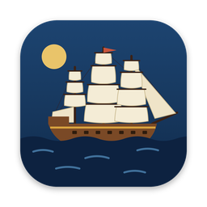

  

<h1 align="center">Quartermaster</h1>

  Move research data between your computer, analysis servers, and an archive, 
  with every file checked, and nothing deleted until everything has arrived.

  <a href="https://github.com/jonathonthill/quartermaster/releases"><b>Download for macOS, Windows, or Linux</b></a>

## What it does

Quartermaster has two panes, like an FTP program, and two modes, switched in the top bar.

| | **Transfer** mode | **Stow** mode |
|---|---|---|
| **For** | Everyday copies between machines | Long-term storage in an archive (a *datahold*) |
| **Left and right** | This computer, a file server, or an SFTP server, on either side | This computer or a file server → a datahold |
| **Files arrive** | Exactly as they were | Compressed, with duplicates stored once, sealed into a *barrel* per project, and protected with PAR2 repair data |
| **Checked by** | SHA-256 checksum of every file | SHA-256 checksum of every file, rechecked on a schedule |
| **Getting files back** | Copy them back | Retrieve any single file or folder; no unpacking needed |

Both modes:

- **Check every file.** A copy only takes its final name once its checksum matches the original.
- **Never lose originals.** *Move* deletes them only after the whole transfer has arrived and been verified.
- **Continue where they stopped.** Pause and play any transfer, even after a lost connection or a restart.
- **Can be undone.** *Abandon ship* (the skull) stops a transfer and removes only what it created.
- **Sign in like Terminal.** The app uses your computer's own `ssh`, so your `~/.ssh/config`, keys, passwords, and Duo all work, with the prompts shown in the app.

It can also:

- **Use servers you can't install anything on**, as *SFTP servers* (Transfer mode). These are checked by size and date, or fully by reading each upload back.
- **Run transfers on the server itself.** Between a file server and a datahold, the data goes straight from server to server, so you can close your laptop.
- **Keep a Trash on servers.** Deleting sends things to the Trash, here and on servers, where you can restore them or delete them for good.
- **Open several windows** (⌘N), each with its own connections and transfers.

## Getting started

1. **Download** the app from [Releases](https://github.com/jonathonthill/quartermaster/releases). The builds aren't signed yet, so the first launch needs one extra step:
   - **macOS**: drag Quartermaster to Applications, then right-click it and choose **Open**, and **Open** again. If macOS says the app "is damaged", run `xattr -dr com.apple.quarantine /Applications/Quartermaster.app` in Terminal.
   - **Windows**: if SmartScreen appears, choose **More info**, then **Run anyway**. (Windows builds are newer and less tested.)
   - **Linux**: use the `.AppImage` (make it executable) or the `.deb`.
2. **Add a server.** In a pane's menu, choose **Add a file server…** (or **Add a datahold…** in Stow mode). Enter its address and press **Connect**. Untick **Save this server** for a one-off connection.
3. **Let it install its helper**, if asked. A small program goes into your home folder on the server; nothing needs an administrator.
4. **Select files and press → or ←**, or drag them across. Choose **Copy** or **Move**, and watch progress in the **Dock** along the bottom.

## Words you'll see

| In the app | Means |
|---|---|
| **Datahold** | An archive on a storage server |
| **Barrel** | A project in a datahold: a sealed folder you can add to, rename, or move as a whole, but not change inside |
| **Dock** | The list of transfers along the bottom |
| **Abandon ship** | Stop a transfer and undo it |
| **Throw overboard** | Delete: to the Trash on your computer or a server, or to a datahold's **Overboard** (restorable for 30 days) |

## Tips

- **⌘L** (or typing `/` or `~` in a list) lets you type a folder path; **Tab** completes it.
- **Delete** (or ⌘⌫) sends the selection to the Trash. Nothing pops up, because it can be undone.
- Closing a window with transfers running asks first: **Pause and close** keeps them for later.
- Going back to a folder returns to where you were scrolled.

## More

- [Guide](docs/GUIDE.md): how everything behaves, in detail
- [Developing](docs/DEVELOPING.md): building, setting up servers by hand, importing old backups, and the `archive` command-line tool
- [Storage format](docs/FORMAT.md) and [protocol](docs/PROTOCOL.md)

Quartermaster is MIT licensed. Servers: Linux and FreeBSD (including TrueNAS) on x86_64 run the helper; anything with SFTP works in Transfer mode.
